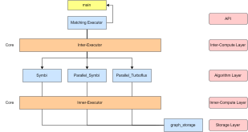

# ParaCOSM Program Architecture

The system follows a **layered architecture** that separates concerns across API, execution, algorithm, and storage components. The design ensures modularity, extensibility, and efficient parallel computation for subgraph matching tasks.

* **API Layer**: User-facing interface (`main`).
* **Inter-Compute Layer**: Top-level orchestrator (`Inter-Executor`).
* **Algorithm Layer**: Multiple matching kernels (SymBi, Parallel\_SymBi, Parallel\_TurboFlux).
* **Inner-Compute Layer**: Parallel execution engine (`Inner-Executor`).
* **Storage Layer**: Graph representation and data management (`graph_storage`).

### 1. API Layer

The **API Layer** provides the external entry point of the system. It exposes high-level interfaces to users or applications via the `main` function, which invokes the matching executor and controls execution flow.

### 2. Inter-Compute Layer

At the top of the compute stack lies the **Inter-Executor**, which coordinates multiple algorithms and manages inter-kernel execution. It is responsible for:

* Orchestrating algorithm selection (e.g., SymBi, TurboFlux).
* Handling configuration parameters (thread count, homomorphism, vertex ordering, etc.).
* Managing task scheduling and delegating work to the inner execution layer.

### 3. Algorithm Layer

The **Algorithm Layer** hosts multiple subgraph matching kernels:

* **SymBi**: A base algorithm for candidate filtering and recursive search.
* **Parallel\_SymBi**: A parallelized version of SymBi, leveraging OpenMP/TBB for concurrency.
* **Parallel\_TurboFlux**: A parallelized implementation of the TurboFlux algorithm.

Each algorithm implements its own matching logic but adheres to a common interface so that it can be coordinated by the Inter-Executor.

### 4. Inner-Compute Layer

The **Inner-Executor** forms the core parallel execution engine. It provides:

* Fine-grained parallelization of enumeration tasks.
* Thread-local states to minimize contention.
* Dynamic task splitting and load balancing using OpenMP and TBB.

The Inner-Executor serves as the execution backbone for all supported algorithms.

### 5. Storage Layer

The **Storage Layer** consists of `graph_storage`, which manages the graph representation. This layer provides efficient data structures for graph indexing, adjacency queries, and candidate retrieval. It serves as the foundation for all higher-level matching algorithms.

---

This hierarchical organization decouples user interaction, execution orchestration, algorithmic logic, and storage management, enabling scalability and modular extensibility.

