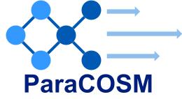

<!--  -->


<p align="center">

</p>


# ParaCOSM: Parallel Framework for Continuous Subgraph Matching

Haibin Lai, Sicheng Zhou, Site Fan, Zhuozhao Li*


## Abstract

Continuous Subgraph Matching (CSM) has been widely studied, yet most single-threaded algorithms struggle with large query graphs. Existing CSM algorithms on CPU suffer from load imbalance in searching and sequential updates to the index structure.

In this paper, we present `ParaCOSM` (Parallel COntinuous Subgraph Matching), an efficient parallel framework for existing CSM algorithms on CPU. `ParaCOSM` leverages two levels of parallelism: inner-update parallelism and inter-update parallelism. Inner-update parallelism uses a fine-grain parallelism approach to decompose the search tree during each CSM query, enabling efficient search for large queries under load balancing. In inter-update parallelism, we introduce an innovative safe-update mechanism that uses multi-threading to verify the safety of multiple updates, thereby enhancing the overall throughput of the system under large-scale update scenarios.
`ParaCOSM` achieves 1.2 X to 30.2 speedups across datasets and up to two orders of magnitude faster execution, with up to 71% higher success rates on large query graphs.


## Compile


Our framework requires c++17 and intel icpx with onetbb. One can compile the code by executing the following commands. 

```shell
source /path/to/intel/oneAPI/setvars.sh
mkdir build && cd build
cmake .. -DCMAKE_BUILD_TYPE=Release
make -j
```


## Execute

After a successful compilation, the binary file is created under the `build/` directory. One can execute CSM using the following command.

```shell
build/csm -q <query-graph-path> -d <data-graph-path> -u <update-stream-path> -a <algorithm>
```

where `<algorithm>` is chosen from `parallel_graphflow`, `parallel_turboflux`, and `parallel_symbi` etc.


```shell
build/csm -q <query-graph-path> -d <data-graph-path> -u <update-stream-path> -a <algorithm> --max-results 1 --time-limit 3600
```


## Input File Format
Both the input query graph and data graph are vertex- and edge-labeled. Each vertex is represented by a distinct unsigned integer (from 0 to 4294967295). There is at most one edge between two arbitrary vertices. 

### Query Graph

Each line in the query graph file represent a vertex or an edge.

1. A vertex is represented by `v <vertex-id> <vertex-label>`;
2. An edge is represented by `e <vertex-id-1> <vertex-id-2> <edge-label>`.

The two endpoints of an edge must appear before the edge. For example, 

```
v 0 0
v 1 0
e 0 1 0
v 2 1
e 0 2 1
e 2 1 2
```

### Initial Data Graph

The initial data graph file has the same format as the query graph file.

### Graph Update Stream

Graph update stream is a collection of insertions and deletions of a vertex or an edge.

1. A vertex insertion is represented by `v <vertex-id> <vertex-label>`;
2. A vertex deletion is represented by `-v <vertex-id> <vertex-label>`;
3. An edge insertion is represented by `e <vertex-id-1> <vertex-id-2> <edge-label>`;
4. An edge deletion is represented by `-e <vertex-id-1> <vertex-id-2> <edge-label>`;

The vertex or edge to be deleted must exist in the graph, and the label must be the same as that in the graph. If an edge is inserted to the data graph, both its endpoints must exist. For example,

```
v 3 1
e 2 3 2
-v 2 1
-e 0 1 0
```


## Develop guide

To add your new algorithm, you only need to modify two major funcions in the according files:

1. ParaCOSM/core/FindMatchesKernel

2. ParaCOSM/core/SingleThreadKernel


## Update log

2/8 docs 
- dataflow.md
- Subgraph Matching

4/8 code

Finish init code for 5 algorithm


4/20 

Refactor

## Dataset


The datasets and corresponding querysets used in our paper can be downloaded from
https://drive.google.com/file/d/1GNSme2eXsNT6YCqUOoLl1UQCsoykldDY/view

