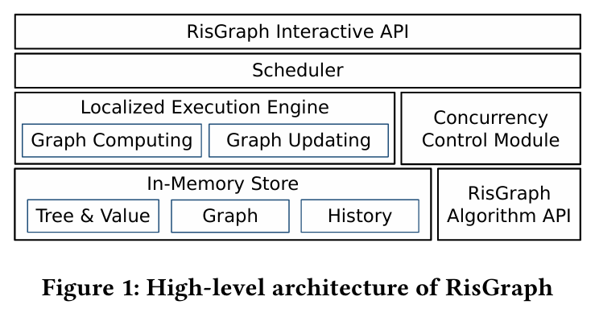
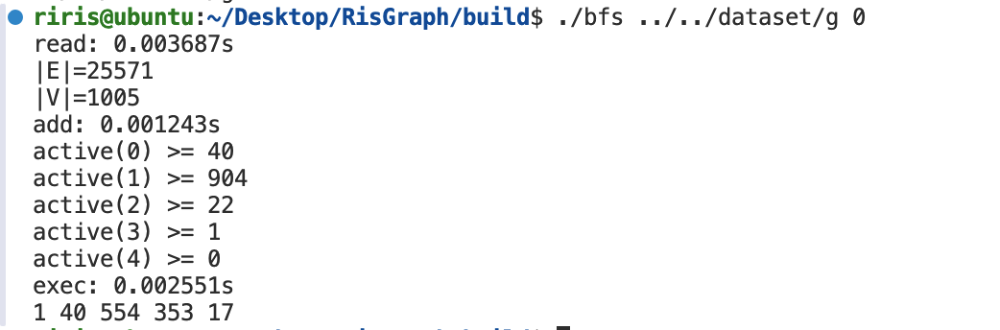
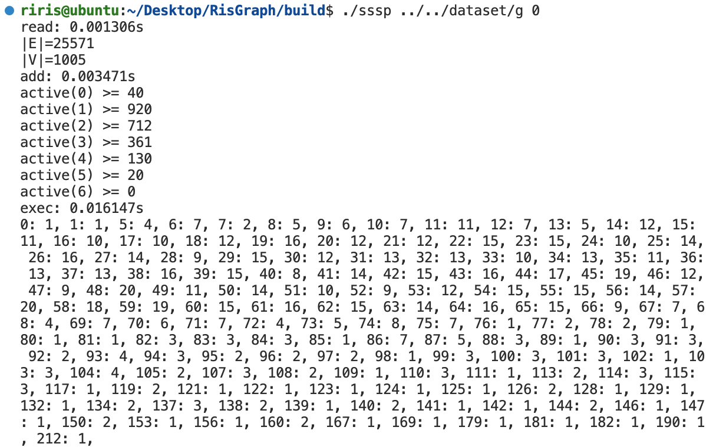

# RisGraph: A Real-Time Streaming System for Evolving Graphs


## Discriminator Design Reference Experiment

<!-- use risgraph figure -->



### 1. Reread the discriminator section and take notes on what it does. 

In **RisGraph**, the **classifier** module is responsible for **dividing updates into safe and unsafe updates**:

* **Safe updates** (those that will not change the analysis result) include:

  1. Adding or deleting isolated vertices;
  2. Deleting edges that are **not in the dependency tree**;
  3. Adding edges where `need_update()` returns `false`.

* **Unsafe updates** (those that might affect the result) are added to a **FIFO queue** and processed by the computing engine one by one.

The classifier relies on a “**parent pointer tree**” (each vertex maintains a single parent pointer) to efficiently determine whether an edge is part of the dependency tree and thus classify updates quickly.

---

### 2. Draw a diagram of the underlying mechanism. (20 points)

Referencing Figure 3 in the paper, the following conceptual flowchart illustrates the mechanism:

```plaintext
                +-------------+
                |   Update    |
                | (edge/vertex)|
                +------+------+
                       |
                       v
                +-------------+
                | Classifier  |
                +-------------+
               /               \
         Safe /                 \ Unsafe
            v                     v
+-------------------+     +--------------------+
| Apply in Parallel |     |    FIFO Queue      |
|   Modify Graph     |     | Wait for Scheduling|
+-------------------+     +--------------------+
                                 |
                                 v
                          +--------------+
                          |  Computing   |
                          |    Engine    |
                          +--------------+
```


---

### 3. Study how the code uses this discriminator.

In RisGraph, each graph algorithm must define an `update_func()` (or the equivalent `need_update()` + `update_value()` pair) that determines whether a given edge update should propagate a value change to the destination node.

* **BFS Example**:

```cpp
auto update_func = [](uint64_t src, uint64_t dst, uint64_t src_data, uint64_t dst_data, decltype(graph)::adjedge_type adjedge) 
    -> std::pair<bool, uint64_t> {
    return std::make_pair(src_data + 1 < dst_data, src_data + 1);
};
```



* **SSSP Example**:

```cpp
auto update_func = [](uint64_t src, uint64_t dst, uint64_t src_data, uint64_t dst_data, decltype(graph)::adjedge_type adjedge) 
    -> std::pair<bool, uint64_t> {
    return std::make_pair(src_data + adjedge.data < dst_data, src_data + adjedge.data);
};
```



According to Section 4 of the paper, the key to determining whether an update is unsafe lies in whether `need_update()` returns `true`. If so, the classifier treats it as an unsafe update, which will modify the result and should be processed sequentially.

---

## Testing Experiment

### 1. Read the experimental section to understand how the authors evaluated the system. (20 points)

Section 5 of the paper presents a comprehensive experimental setup:

* **Platform**: Dual-socket Intel Xeon Gold CPUs, 576GB RAM;

* **Datasets**: Multiple large real-world graphs (e.g., Twitter, UK2007, Wiki);

* **Setup**:

  * Preload 90% of the graph;
  * Stream the remaining 10% edges as insertion/deletion updates;
  * Use **sessions** to simulate real users continuously issuing updates.

* **Metrics**:

  * Throughput (updates per second);
  * Average latency and 99.9th percentile latency (targeted < 20ms);
  * Scalability (up to 3072 concurrent sessions).

**Conclusion**: RisGraph achieves million-level throughput while maintaining strict latency constraints on commodity hardware.

---

### 2. Study the API design. 

Based on Table 3 and Table 4 in the paper, here’s a summary:

#### System APIs:

| Function                            | Description                                            |
| ----------------------------------- | ------------------------------------------------------ |
| `add/del_edge(edge)`                | Add/delete an edge and return the `version_id`         |
| `update_edge(edge, new_data)`       | Update edge weight                                     |
| `add/del_vertex(vertex_id)`         | Add/delete a vertex                                    |
| `get_value(version_id, vertex_id)`  | Get the result value of a vertex at a specific version |
| `get_parent(version_id, vertex_id)` | Get the parent edge of a vertex in the dependency tree |
| `get_current_version()`             | Get the current version of the graph                   |
| `get_modified_vertices(version_id)` | Get all modified vertices in that version              |
| `clear_history(version_id)`         | Clean all history before the specified version         |

#### User-Defined Functions (UDFs):

| Function                               | Description                                       |
| -------------------------------------- | ------------------------------------------------- |
| `init_value(vid)`                      | Initial value of each vertex                      |
| `need_update(edge, src_val, dst_val)`  | Return whether an update is needed                |
| `update_value(edge, src_val, dst_val)` | Return new value after update                     |
| `equal_value(edge, src_val, dst_val)`  | Check if value is already equal (for convergence) |

---

### 3. (Optional) Further testing on VMware. 

To reproduce experiments on your own:

1. Set up an Ubuntu VM (64GB+ memory recommended);
2. Load datasets (e.g., Twitter, Wiki) or use synthetic Graph500 graphs;
3. Implement or use RisGraph-like update framework with custom `update_func`;
4. Measure:

   * Updates per second;
   * Tail latency (e.g., 99.9th percentile);
   * Ratio of safe vs. unsafe updates.

---

If you'd like me to generate this into a formatted Markdown or LaTeX document, or help draw diagrams or create experiment scripts, let me know!


---

## 判别器设计参考实验

### 1. 重读文章的判别器段落，用笔记记录判别器做了什么。

在 RisGraph 中，**判别器（Classifier）**模块的核心任务是**将更新划分为 safe update 与 unsafe update**：

* **Safe update**（不会改变分析结果）包括：

  1. 所有孤立顶点的添加/删除；
  2. 不在依赖树上的边的删除；
  3. 添加边后 `need_update()` 返回 `false` 的情况。

* **Unsafe update**（可能影响分析结果）需要进入一个 FIFO 队列，由计算引擎逐一处理。

判别器逻辑依赖于“parent pointer tree”（每个顶点有一个 parent 指针）判断边是否在依赖树上，从而能高效判断是否属于 safe update。

---

### 2. 画出其类似的原理图。

参考论文 Figure 3，可画如下原理图：

```plaintext
                +-------------+
                |  Update     |
                | (edge/vertex)|
                +------+------+
                       |
                       v
                +-------------+
                |  Classifier |
                +-------------+
               /               \
         Safe /                 \ Unsafe
            v                     v
+-------------------+     +--------------------+
| Apply in Parallel |     | FIFO Queue         |
| Modify Graph      |     | Wait for Scheduling|
+-------------------+     +--------------------+
                                 |
                                 v
                          +-------------+
                          | Computing   |
                          | Engine      |
                          +-------------+
```

---

### 3. 在代码段中学习其是怎么使用这个判别器的。

在 RisGraph 中，每个图算法需用户自定义一个 `update_func()`（或 `need_update()` + `update_value()` 组合），用于判断一条边是否引起目标节点值的变化，从而确定是否属于 unsafe update：

* **BFS 示例：**

```cpp
auto update_func = [](uint64_t src, uint64_t dst, uint64_t src_data, uint64_t dst_data, decltype(graph)::adjedge_type adjedge) 
    -> std::pair<bool, uint64_t> {
    return std::make_pair(src_data + 1 < dst_data, src_data + 1);
};
```

* **SSSP 示例：**

```cpp
auto update_func = [](uint64_t src, uint64_t dst, uint64_t src_data, uint64_t dst_data, decltype(graph)::adjedge_type adjedge) 
    -> std::pair<bool, uint64_t> {
    return std::make_pair(src_data + adjedge.data < dst_data, src_data + adjedge.data);
};
```

根据论文第 4 节的描述，判断是否是 unsafe update 的核心就在于 `need_update()` 返回值是否为 `true`，即是否需要传播。该函数输出会影响是否更新依赖树，也决定是否需交给调度器顺序处理。

---

## 测试实验

### 1. 阅读其实验段落，理解其如何实验。

论文第 5 节进行了系统全面的实验：

* 实验平台：双路 Xeon Gold CPU + 576GB 内存；
* 数据集：使用了多个大规模真实图，如 Twitter、UK2007 等；
* 实验内容：

  * 将图划分为 90% preload，10% 作添加和删除更新；
  * 采用 session 模拟真实用户负载（每个 session 持续发出 update 请求）；
  * 目标指标包括：

    * 吞吐量（op/s）；
    * 平均延迟、P99.9 延迟（需控制在 20ms 以内）；
    * 可伸缩性（支持 3072 session）。

结论：RisGraph 在各种图上均能实现百万级吞吐，并满足严格延迟需求。

---

### 2. 学习其API设计。

表格来自论文 Table 3 和 Table 4，总结如下：

#### 系统 API：

| 函数                                  | 功能                     |
| ----------------------------------- | ---------------------- |
| `add/del_edge(edge)`                | 添加/删除边，返回 version\_id  |
| `add/del_vertex(vid)`               | 添加/删除顶点，返回 version\_id |
| `update_edge(edge, new_data)`       | 更新边权                   |
| `get_value(version_id, vid)`        | 获取指定版本某节点值             |
| `get_parent(version_id, vid)`       | 获取某节点在依赖树中的父亲          |
| `get_modified_vertices(version_id)` | 获取该版本所有被修改的节点          |
| `get_current_version()`             | 当前版本号                  |
| `clear_history(version_id)`         | 清理历史记录                 |

#### 用户定义函数（UDF）：

| 函数                                     | 功能            |
| -------------------------------------- | ------------- |
| `init_value(vid)`                      | 顶点初始值         |
| `need_update(edge, src_val, dst_val)`  | 是否需要更新        |
| `update_value(edge, src_val, dst_val)` | 更新后的值         |
| `equal_value(...)`                     | 值是否相等（用于判断收敛） |

---

### 3. （可选）在VMware上进行进一步的测试。

若需复现实验，可按如下步骤：

1. 安装大内存 Ubuntu 虚拟机（推荐 64GB+ RAM）；
2. 编译并运行类似 BFS/SSSP 的增量图算法框架；
3. 使用 SNAP 数据集或 Graph500 合成数据进行流式更新；
4. 实现 update\_func 判定逻辑；
5. 统计：

   * 每秒更新数；
   * P99 延迟；
   * 被分类为 safe vs unsafe update 的比例。

---


