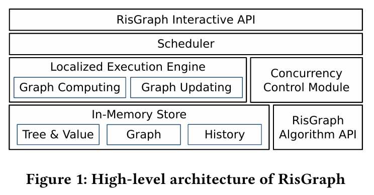
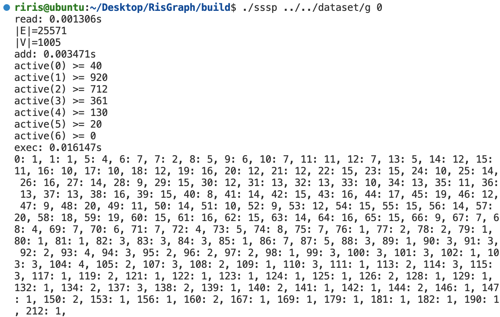

# RisGraph Deep Dive and Experiment Notes

## Overview

RisGraph ([https://github.com/thu-pacman/RisGraph](https://github.com/thu-pacman/RisGraph)) is a high-performance real-time streaming graph system capable of handling millions of concurrent updates. This document captures our investigation, experimental validation, and code analysis related to RisGraph, with a focus on understanding how it achieves inter-update and intra-update parallelism through TBB and OpenMP.

---

## Step 1: Running RisGraph Locally

### Deployment Instructions

* OS: Ubuntu 18.04
* Dependencies: Install all packages using `apt-get` as listed in the GitHub repo.
* Compilation: Follow the repository instructions. The final binaries will appear in the `build/` directory.

### Dataset and Preprocessing

* Dataset: [email-Eu-core](https://snap.stanford.edu/data/email-Eu-core.html)
* Preprocessing: Convert text data to binary format to improve memory efficiency.

```bash
cd ~/Desktop/RisGraph/build
./convert_to_binary < ../../dataset/email-Eu-core.txt > ../../dataset/g
```

### Running BFS and SSSP

#### BFS

```bash
# Basic BFS
./bfs ../../dataset/g 0

# Incremental BFS
./bfs_inc ../../dataset/g 0 0.1

# Real-time BFS with latency-aware scheduler
./bfs_inc_rt ../../dataset/g 0 0.1 100 0.9 16

# Batch update BFS
./bfs_inc_batch ../../dataset/g 0 0.1 10

# BFS with classifier
./bfs_inc_clf ../../dataset/g 0 0.1
```

#### SSSP

```bash
./sssp ../../dataset/g 0
```

---

## Code and Architecture Analysis

### Graph Storage

* Each `Graph` maintains `outgoing` and `incoming` edge storage.
* Implemented using `IndexedEdgeStorage` with fallback to `adjlist_map` (a hash table) depending on graph size.

### Binary Format Motivation

* Graph is memory-mapped via `mmap_binary()`.
* Binary format avoids encoding overhead and reduces memory usage.

### Core Execution Logic (e.g., BFS)

```cpp
graph.build_tree<uint64_t, uint64_t>(
    init_label_func,
    continue_reduce_print_func,
    update_func,
    active_result_func,
    labels
);
```

* This function constructs the dependency tree using vertex and edge streaming.
* The loop continues until convergence based on `continue_reduce_print_func()`.

### Parallelism Design

#### Intra-update Parallelism

* Achieved via TBB or OpenMP within `stream_vertices()` and `stream_edges()`.
* **TBB** is used for sparse graphs for fine-grained parallelism and better load balance.
* **OpenMP** is used for dense graphs for simpler bulk parallelism.

#### TBB Example:

```cpp
tbb::parallel_reduce(tbb::blocked_range<uint64_t>(0, length, 64), reducer,
    [&](const tbb::blocked_range<uint64_t> &range, R res) -> R {
        for(uint64_t i = range.begin(); i != range.end(); i++) {
            res += sparse_process(...);
        }
        return res;
    },
    [](R x, R y) -> R { return x + y; },
    tbb::affinity_partitioner()
);
```

#### OpenMP Example:

```cpp
#pragma omp parallel for reduction(+: reducer)
for (size_t i = 0; i < num_vertices; i++) {
    // Vertex-level parallel processing
}
```

### Incremental Update Modes

#### `bfs_inc`

* Loads base graph and re-runs BFS after injecting a percentage of new edges.
* Calls `graph.update_tree_add()` internally.

#### `bfs_inc_rt`

* Adds latency-aware update scheduling.
* Uses `need_update_tree_add()` to classify safe vs. unsafe updates.
* Unsafe updates are queued and processed serially to guarantee result consistency.

#### `bfs_inc_batch`

* Processes incremental updates in batches.
* Uses `THRESHOLD_OPENMP_LOCAL` to decide parallel mode.

#### `bfs_inc_clf`

* Includes classifier and latency distribution statistics.

```cpp
bool need_update_tree_add(...) {
    return update_func(...).first; // Typically src_data + 1 < dst_data
}
```

---

## Step 2: RisGraph Source Code Structure



* `stream_vertices()` and `stream_edges()` are the entry points for edge- and vertex-parallel operations.
* TBB and OpenMP are selectively used depending on density of active region.

---

## Parallel BFS Using TBB and OpenMP

### TBB Version (Sparse Graphs)

```cpp
void bfs_tbb(const Graph& g, std::vector<int>& dist, int root) {
    std::vector<int> frontier = {root};
    dist[root] = 0;

    while (!frontier.empty()) {
        std::vector<int> next;
        tbb::parallel_for(size_t(0), frontier.size(), [&](size_t i) {
            for (auto v : g.neighbors(frontier[i])) {
                if (dist[v] == -1) {
                    dist[v] = dist[frontier[i]] + 1;
                    #pragma omp critical
                    next.push_back(v);
                }
            }
        });
        frontier = std::move(next);
    }
}
```

### OpenMP Version (Dense Graphs)

```cpp
void bfs_omp(const Graph& g, std::vector<int>& dist, int root) {
    std::vector<int> frontier = {root};
    dist[root] = 0;

    while (!frontier.empty()) {
        std::vector<int> next;
        #pragma omp parallel
        {
            std::vector<int> local_next;
            #pragma omp for nowait
            for (int i = 0; i < frontier.size(); ++i) {
                for (int v : g.neighbors(frontier[i])) {
                    if (dist[v] == -1) {
                        dist[v] = dist[frontier[i]] + 1;
                        local_next.push_back(v);
                    }
                }
            }
            #pragma omp critical
            next.insert(next.end(), local_next.begin(), local_next.end());
        }
        frontier = std::move(next);
    }
}
```

---

## Next Steps

* Analyze `stream_edges()` vs. `stream_vertices()` dispatching logic.
* Profile tail-latency distribution under different scheduling policies.
* Prototype a new `update_func()` for custom graph algorithms.
* Experiment with replacing TBB with Taskflow or std::execution for comparison.


# RisGraph调研

RisGraph(https://github.com/thu-pacman/RisGraph.git) 做到了百万并发，它是怎么做的？它的更新内并行与更新间并行是怎么做的？我们需要学习其对TBB库与OpenMP的使用方法。

## Step 1 跑一次RisGraph

https://github.com/thu-pacman/RisGraph.git 按照该仓库进行一个实验的跑（可以对BFS、SSSP进行跑，他们离我们最近），明确其运行的脚本和读取方式。已完成。

部署：需要用ubuntu18.04，用apt-get安装所有依赖。然后按照仓库指示完成编译。编译好的结果在build目录下。

### 运行
1. 下载数据集。选择了[一个比较小的数据集](https://snap.stanford.edu/data/email-Eu-core.html)做测试，路径`Desktop/dataset/email-Eu-core.txt`. 之前也试过大一点的数据集，但是对内存要求比较高，虚拟机有点吃不住。
2. 数据预处理：排序以及convert to binary。新建一个空文件，然后把结果写入其中。

```bash
cd ~/Desktop/RisGraph/build
touch ../../dataset/g
./convert_to_binary < ../../dataset/email-Eu-core.txt > ../../dataset/g # 保持原来顺序
```

3. **BFS**. 指定根节点，输出每一层节点的数量。active指的是每一层的活跃节点的个数，当没有新的活跃节点时遍历结束。

    ```bash
    # 基础bfs。语法 ./bfs binary_graph_path root
    ./bfs ../../dataset/g 0
    
    # 增量bfs，原数据集中取一部分作为更新增量。语法 ./bfs_inc binary_graph_path root initial_edges_percent
    ./bfs_inc ../../dataset/g 0 0.1
    
    # 具有安全/不安全分类和延迟感知调度器。语法 ./bfs_inc_rt binary_graph_path root initial_edges_percent target_tail_latency tail_latency_percent num_of_clients
    # 模拟num_of_clients个客户插入/删除边请求更新。通过延迟感知调度器使tail_latency_percent更新在target_tail_latency毫秒内。
    ./bfs_inc_rt ../../dataset/g 0 0.1 100 0.9 16
    
    # batch update. 语法 ./bfs_inc_batch binary_graph_path root initial_edges_percent batch_size
    ./bfs_inc_batch ../../dataset/g 0 0.1 10
    
    # 带分类器的增量bfs. 语法同bfs_inc
    ./bfs_inc_clf ../../dataset/g 0 0.1
    ```

    


    **SSSP**. 指定根节点，输出每一层节点的数量（和bfs的区别：bfs中不考虑实际边的长度，按1算，其他都一样）。比如a: b指的是第a层有b个节点，也就是说到达这b个节点的最短路径长度都是a。
    
    ```bash
    # 语法 ./sssp binary_graph_path root
    ./sssp ../../dataset/g 0
    ```
    
    

### 代码详解：以BFS为例

**1. 怎么储存图的？**

`class Graph`里面有`outgoing`和`incoming`，两个都是`Storage`类型，分别储存出边和入边。`add_edge()`的时候这两个数据结构都要更新。

`Storage`是`IndexedEdgeStorage<>`类型，在执行`update_edge()`方法时会根据储存数据大小是否超过threshold决定是否使用adjlist_map（哈希表）。

**2. 为什么要convert to binary？**

运行代码的时候要先convert to binary再运行后续的应用程序。bfs首先调用`RisGraph/core/io.hpp`中的`mmap_binary()`，把二进制文件映射到内存中，然后直接对内存进行操作。

为什么要用binary？因为这样数据不需要额外的编码开销，对内存要求更小。

**3. 在哪里并行？**

首先，`#pragma omp parallel for`显式并行，计算`num_vertices`和建图。

其次，根据RisGraph给的API，定义好函数丢给`graph.build_tree`，完成。

```cpp
        graph.build_tree<uint64_t, uint64_t>(
            init_label_func,
            continue_reduce_print_func,
            update_func,
            active_result_func,
            labels
        );
```

`build_tree`里面做了什么？这是一个模板函数，用于遍历图中的节点并更新每个节点的状态，构建dependency tree。最外层是一个for形式的while循环，终止条件是`continue_reduce_print_func`。在其中使用了stream_vertices和stream_edges来遍历点和边，在这些遍历中实现并行。

以stream_edges为例。通过遍历出边和入边，算法计算每条边的更新和活跃标志，并收集最终结果。

**Sparse并且图小**时，串行计算。

**Sparse但是图大**时，用`tbb::parallel_reduce`并行计算。这里不用OpenMP是因为OpenMP通常使用静态调度，在稀疏图上容易导致负载不均衡。TBB 采用的是任务划分和动态调度的方式，工作被拆分成更小的任务，这些任务可以根据实际的工作负载动态分配。

- `tbb::blocked_range<uint64_t>(0lu, length, 64)`创建一个从 0 到 length 的分块范围，步长为 64，表示将任务分成 64 个元素一块。

- range 是每个线程将要处理的子范围，通过`range.begin()`和`range.end()`来确定每个线程处理的部分。

- `sparse_process(v_i, outgoing.get_adjlist_iter(v_i))`：对于每个顶点 v_i，调用 sparse_process 来处理该顶点的邻接列表。

- 归约函数 [](R x, R y) -> R { return x + y; } 用于将不同线程的结果合并。这里是对结果的求和。

- affinity_partitioner 是一个分配器，用于优化内存访问模式和线程亲和性（通常用来提高性能）。

```cpp
                reducer = tbb::parallel_reduce(tbb::blocked_range<uint64_t>(0lu, length, 64), reducer, 
                [&](const tbb::blocked_range<uint64_t> &range, R res) -> R
                {
                    for(uint64_t i=range.begin();i!=range.end();i++)
                    {
                        uint64_t v_i = active[i];
                        if(outgoing.get_degree(v_i)) res += sparse_process(v_i, outgoing.get_adjlist_iter(v_i));
                    }
                    return res;
                },
                [](R x, R y) -> R
                {
                    return x+y;
                },
                affinity_partitioner);
```

**Dense**时，用OpenMP来并行处理图中的每个顶点。

最终返回累加的reducer结果，这个值是所有边处理结果的累积。

**4. bfs_inc多干了什么？**

首先输出初始化的结果，然后输出inc之后的结果，最后再调用一次build_tree验证inc是否正确。


更新的时候调用了`graph.update_tree_add`，其中又调用了`do_update_tree_add`。定义三个lambda函数作为stream_edges_hybrid的输入参数，分别处理出边、入边和边相关的计算。其中可能调用stream_edge或者stream_edge_sparse。stream_edge_sparse里面的逻辑类似stream_edge，如果边数多则使用tbb来并行，少则直接串行。

**5. bfs_inc_rt多了什么？**

用while遍历所有update，然后用`#pragma omp parallel reduction(+: sum_nanoseconds)`并行。

对每一个update，首先用`graph.need_update_tree_add()`方法判断safe/unsafe update，然后把unsafe的边通过`atomic_append()`加入`add_edge`队列供后续处理。并行结束。

串行遍历队列中的update，调用`graph.update_tree_add()`完成更新和计算。最后输出latency统计结果和计算结果。


注意这个用来判断safe/unsafe update的判别器是这样写的。主要调用了`update_func()`，返回这个函数的第一个结果，在这份代码里是`src_data+1 < dst_data`。

```cpp
    template <typename DataType, typename UpdateFunc>
    bool need_update_tree_add(
            UpdateFunc update_func, 
            std::vector<VertexTree<DataType>> &labels, edge_type edge, bool directed = true)
    {
        if(!directed)
        {
            bool retl = need_update_tree_add<DataType>(update_func, labels, edge, true);
            std::swap(edge.src, edge.dst);
            bool retr = need_update_tree_add<DataType>(update_func, labels, edge, true);
            return retl || retr;
        }
        return (update_func(edge.src, edge.dst, labels[edge.src].data, labels[edge.dst].data, edge).first);
    }
```

**6. bfs_inc_batch多了什么？**

用for循环遍历inc的边，每个循环处理一个batch。用THRESHOLD_OPENMP_LOCAL对add_edge进行并行，将unsafe的边加入added_edges队列，然后调用update_tree_add处理这些unsafe edge。


**7. bfs_inc_clf是什么？**

加入分类器，统计unsafe边的占比和更新耗时分布。


## Step 2 阅读RisGraph源码


原文 https://dl.acm.org/doi/pdf/10.1145/3448016.3457263 提到了Edge-parallel and vertex-parallel方法，看看他们在具体代码里是怎么做的。猜测对应到代码里是stream_vertices和stream_edges。

我们可能先需要看懂整个代码结构在做什么，然后针对两个并行，重点看TBB和OpenMP是怎么使用的


### TBB API 学习
如何用TBB/OpenMP写一个BFS
