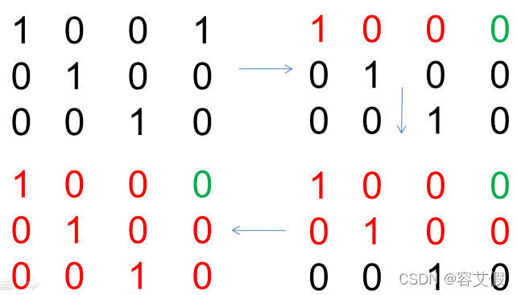
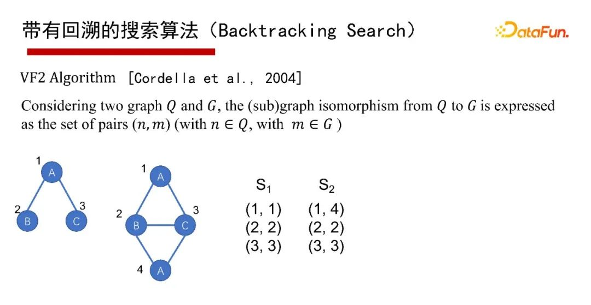
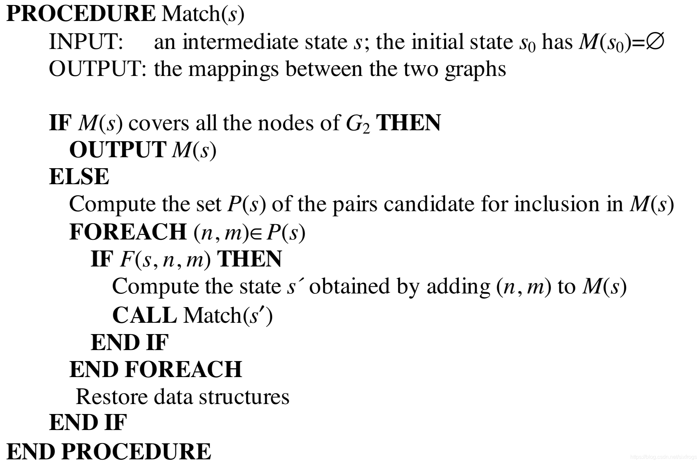

我们在这里总结子图匹配（Subgraph Matching, Subgraph Isomorphism）图算法的。

数学理论介绍
https://arxiv.org/abs/1512.03547

## 什么是子图匹配？


子图匹配核心概念是给到一个查询图Q和一个数据图G，Q里的每一个点通过一个单射函数映射到G当中去，即单射函数$f:V(Q)→V(G)$。Q中的每一个点在单射函数 $F$ 作用下唯一映射到G的每个点上去，如上图中Q的1、2、3在G的中的第一个子图匹配是（1、2、3），第二个子图匹配是（2、3、4）。子图匹配的本质就是给一个Q，找到Q在G中的所有匹配，如示例中找到所有的二叉结构。


从计算复杂性来讲，子图匹配是一个非常复杂的问题。如果对查询图Q不加限制，子图匹配的判定是NP-Complete的；列举所有的子图匹配出现的位置是NP-Hard。虽然匹配算法本身是指数的，但在实践中，可以采用大量的过滤策略来检索搜索空间，从而提高查询的性能。

我们在 *《数据挖掘》* 一书中找到了如下的解释：

**定义17.2.1（图匹配和重构）**两个图$G_{1}=(N_{1},A_{1})$和$G_{2}=(N_{2},A_{2})$是同构的当且仅当在N1和N2的节点之间可以找到满足以下属性的一一对应关系：

1. 对于每一对对应的节点$i∈N_1$和$j\in N_2$，它们的标签是相同的。
​$l(i)=l(j)$

2. 令 $[i_1，i_2]$ 为 $G_1$ 中的节点对，$[j_1，j_2]$ 为 $G_2$中的对应节点对。 那么当且仅当边 $(j_1，j_2)$ 存在于 $G2$ 中时，边 $(i_1，i_2)$ 存在于G1中。

图匹配中的计算挑战是由于节点标签中的重复引起的。 例如，考虑两个甲烷分子， 虽然两个分子中的独特碳原子可以完全匹配，但是氢原子可以在其中匹配4！ = 24种不同的方式。中示出了两种可能的匹配。 一般来说，每个图中标签重复的级别越高，可能匹配的数量就越大。 一对图之间可能匹配的数量随着匹配图的大小呈指数增长。 对于每个包含n个节点的一对图，可能匹配的数目可以与 $n!$ 一样大。 这使得在计算上匹配一对图的问题非常昂贵。‘

**引理17.2.1**  确定一对图之间是否存在匹配的问题是NP难的。

**定义17.2.2(节点导出子图)** 图$G =(N,A)$的节点导出的子图是满足以下性质的图$G_ s =(N_s,A_s)$：

1. $N_s\subseteqq N$
2. $A_s=A\cap(N_s\times N_s)$

换句话说，在子图 $G_s$ 中，包含子集 $N_s$ 中的节点之间的原始图 $G$ 中的所有边。

子图同构可以用节点导出的子图来定义。 查询图 $G_q$ 是数据图 $G$ 的子图同构，当它是G的节点导出子图的精确同构时。

**定义17.2.3（子图匹配和同构** 当且仅当下列条件满足时，查询图 $G_q=(N_q,A_q)$ 是数据图 $G =(N，A)$ 的子图同构：

1. $N_q$ 中的每个节点应该与 $N$ 中具有相同标签的唯一节点相匹配，但 $N$ 中的每个节点可能不一定匹配。 对于每个节点$i∈N_q$，必须存在唯一的匹配节点$j∈N$，使得它们的标签是相同的。

​$l(i)=l(j)$

2. 令$[i1，i2]$成为G_q中的一个节点对，根据上面讨论的匹配，令 $[j1，j2]$ 成为G中相应的节点对。 那么，当且仅当边 $(j1，j2)$存在于G中时，边 $(i1，i2)$ 存在于$G_q$中。
        

本节中的子图同构的定义假定数据图的节点导出子图的所有边都存在于查询图中。 在一些应用中，比如频繁的子图挖掘，使用了一个更一般的定义，其中节点导出子图的边的任何子集也被认为是子图同构。 在本节中对更一般的情况可以通过对算法进行微小更改来处理。 请注意，上述定义允许子图$G_q$（或G）断开。 但是，对于实际应用，通常只关心连通的子图同构。 图17.3说明了一对节点之间两种可能的子图匹配的例子。 该图还表明，一个图形是另一个图形的子图有两种不同的方式。 精确匹配的问题是子图匹配的特例。 因此，子图匹配问题也是NP难的。

**引理17.2.2** 子图匹配的问题是NP难的。

子图匹配通常用作应用程序中的子例程，如频繁模式挖掘。 虽然子图匹配问题是精确匹配的推广，但问题可以进一步推广到在一对图之间寻找最大公共子图（MCG）的问题。 这是因为两个图之间的MCG最多等于两个图中较小的一个，当它是较大图的子图时。 一对图之间的MCG或最大公共同构定义如下。

**定义17.2.4（最大公共子图）** 一对图 $G_1 =（N_1，A_1$ 和 $G_2 =（N_2，A_2$ 之间的MCG是一个图 $G_0 =（N_0，A_0$ ，它是 $G_1$ 和 $G_2$ 的子图同构，并且节点集合$N_0$的大小尽可能大。

因为MCG问题是图同构问题的泛化，所以它也是NP难题。 在本节中，将介绍用于发现子图同构和最大公共子图的算法。 随后，将讨论这些算法与图之间距离计算的关系。 可以设计子图同构算法来确定查询图和数据图之间的所有子图同构，或者可以设计快速算法以确定是否存在至少一个同构。

## 算法发展总图


在一篇SIGMOD 2020实验论文中指出，做子图匹配可以有两类算法，一类为基于深度搜索加回溯的方式（Backtracking Search），一类为基于广度优先的Multi-way Join方法。


这里对子图匹配的两类算法形象化解释一下。假设有个 $Q$ 和一个 $G$ ，找到 $Q$ 在 $G$ 的子图匹配，实际就是在搜索空间查找。这里把搜索空间定义成一个搜索树（如上图左下角的属性图），Backtracking Search搜索的策略是深度优先（DFS搜索），再回溯回来；Multi-way Join搜索的策略则是宽度优先（BFS搜索），即在搜索树上一层一层去找。


### Backtracking Search
带有回溯的搜索算法（Backtracking Search），有1976年最早开始的Ullmann算法，2000年的Ullmann Algorithm算法，2004年的VF2 Algorithm算法等。


这里采用通用的算法框架（Common Framework）来讲讲带有回溯的搜索算法。给一个查询图Q，首先定义一个节点被匹配的顺序，即最先匹配哪个点，然后是哪个点（generate a matching order），然后每次试图按节点匹配顺序进行一个点一个点的匹配；如果当前状态匹配不了，则回溯；如果要找全部的解集，也得做回溯。其优点是可避免产生大量的中间结果，因采用深度优先，仅有递归调用栈的空间，没有什么中间结果。其缺点是难以并行执行，会有大量的递归开销，因此适合做LIMIT K和TOP-K的子图匹配查询，即只返回K个或TOP K个结果（K很小的情况下）。

### Multiway Join


对于宽度优先的算法，实际关系数据库每次的Join就是宽度优先。子图匹配从逻辑来说是T1、T2、T3的Join操作。Join怎么执行呢？从Join执行角度来说，有两种不同的执行方案，一种是Binary Join，即第一张表T1和第二张表T2作Join，结果再与第三张表T3作一次Join，是以边为中心。

**Worst-Case Optimal Join:**

Worst-Case Optimal Join 算法的核心思想是通过集合交运算高效扩展中间匹配结果。我们通过一个具体案例来说明其执行过程：假设在数据图 G 中已经找到查询图 Q 的边 BC 的匹配（即 G 中顶点 v2 对应 Q 的 u2，v3 对应 u3），现在需要进一步寻找符合 Q 中三角形 ABC 结构的完整匹配。

**具体执行步骤如下：**

1. **候选顶点筛选**  
   - 根据已匹配的边 BC（v2-v3），分别获取数据图中 v2 的邻居集合 N(v2) 和 v3 的邻居集合 N(v3)
   - 同时提取查询节点 u1（对应 A 点）在数据图中的候选集合 C(u1)

2. **三向集合交运算（这是Binary所没有的！）**  
   对上述三个集合进行交集运算：  
   ```
   N(v2) ∩ N(v3) ∩ C(u1) = {v1, v4}
   ```  
   该结果说明在数据图中，同时与 v2、v3 相连且符合 u1 候选条件的顶点为 v1 和 v4。
   

3. **生成完整匹配**  
   将交集结果与已匹配的 v2、v3 组合，产生两个满足三角形结构的匹配：  
   - 匹配 1: (v1, v2, v3) 对应 Q 的 (u1, u2, u3)
   - 匹配 2: (v4, v2, v3) 对应 Q 的 (u1, u2, u3)

4. **并行化优势**  
   该算法的关键特性在于：中间结果表中的每一行（如本例的 v2-v3 匹配）的处理过程完全独立。这种无状态的计算特征使得以下操作天然支持并行：  
   - 多行数据可分布式处理
   - 集合交运算可多线程加速
   - 结果生成无顺序依赖

通过这种逐层扩展中间结果、基于集合交运算过滤无效候选的方式，算法既保证了最坏情况下的理论最优时间复杂度，又具备工程实现层面的高效并行能力。


之所以称之为Worst Case Optimal Join，是针对Binary Join而言，其复杂性是和它在worst case情况下的输出结果数量相匹配的。以ABC三角形查询图为例，其最多有$N^{1.5}$个三角形，N是边的数目。如果用Binary Join，有可能会产生$N^2$的中间结果。如果采用Worst Case Optimal Join算法，则永远不可能产生超过$N^{1.5}$的中间结果，其运行时间的复杂性也是$N^{1.5}$。对于其他的查询图，Worst Case Optimal Join也表现出该种特点。


启发式地讲，Worst Case Optimal Join和Binary Join各有好处。Binary Join比较适合没有环或者是树形或者环比较稀少的查询图。Worst Case Optimal Join比较适合密集环形的查询图。因此，比较好的Join方法是依赖于查询图的图结构。

## Ullman(1976) 详解

**想法：变为邻接矩阵，做某种相似变换**


设查询图Q对应的邻接矩阵（adjacency matrix）为 
 ，数据图G对应的邻接矩阵（adjacency matrix）为 
 ，希望找到一种方法，可以判断MA是否是MB的子图，或是MA可以与MB的子图同构；

 基于以上想法，即是否有一种变换 
 ，可以将MA变成什么东西，或是将MB变成一个东西，使这个东西可以判断MA与MB的关系。定义这个变换后的东西为 
 。一个朴素的想法是，如果变化后的东西 
，是MB的一部分，是不是能说明 
是MB的子图，或是与MB同构？

用MA做加法看起来很费劲，而且矩阵也不是为了做加法设计的，那能不能将M'作用到MB上，让这个结果可以与MA相比较？

[知识图谱 ——子图同构算法 Ullmann Algorithm_ullmann算法-CSDN博客](https://blog.csdn.net/weixin_46627433/article/details/122842530)


https://github.com/betterenvi/Ullman-Isomorphism


**Step 1 :**
建立矩阵$M_{n\times m}$，然后判断：

如果
Q中第 i 个顶点与 G 中第 j 个顶点有相同的标签；且
Q中第 i 个顶点的度小于等于G GG中第j 个顶点的度，则：
​
 $$M [ i ] [ j ] = 1$$


**Step 2.**

从矩阵 $M_{n\times m}M$ 
 生成矩阵$M ′$ 
 . 即对 $M_{n\times m}$
 进行逐行检查，将部分不为0的元素变成0，使得矩阵M ′
 满足每行有且仅有一个元素为1,每列最多只有一个元素不为0.（最大深度为 $|MA|$.）


**Step 3**

 按照以下规则判断矩阵M ′ M'M 
 是否满足条件：

$MC=M′(M′⋅MB)T, ∀i∀j:(MA[i][j]=1)⇒(MC[i][j]=1).$


**Step 4** 

迭代以上步骤，列出所有可能的矩阵M ′ M'M 


### 大概想法：找到邻接矩阵的子矩阵，相乘得到一个特殊矩阵，判断该矩阵M`性质来判断是否同构



 将M'与MB点乘，将G中标签为1、2、3的边提取出来。这个结果还是一个邻接矩阵，含义是包含所有G中顶点，但只有顶点1、2、3的边；

为把其他的顶点消除，生成只有顶点1、2、3的诱导子图，将M'与MB点乘转置，再与M'相乘，即得到诱导子图MC；

邻接矩阵是对称的，因此最后只需要将该诱导子图的邻接矩阵与MA相对比即可，MA中存在的边，MC都存在，即表明查询成立，对应的映射为M'；

定义上述方法的公式为 
 ，当下述判断均为真时，表明查询成立，Q在G中的一个映射为M'[1]：


## VF2(2004) 详解

原文：
An Improved Algorithm for Matching Large Graphs

https://blog.csdn.net/sixfrogs/article/details/105572782




VF2算法是对传统的Ullmann算法的一个优化，采用了更多的剪枝策略，能够显著减少搜索空间，提高匹配效率。它的主要优势在于其通过智能剪枝、约束传播和反向传播等策略来减少不必要的计算，从而更快地求解图同构问题。
VF算法能够解决有向/无向，有标签/无标签，图同构问题。

VF2算法的基本思想是通过深度优先搜索（DFS）和回溯的方式来寻找模式图（小图）和目标图（大图）之间的同构关系。算法的核心是通过约束传播和剪枝来有效地减少无效匹配的搜索空间。


算法逻辑：


让我们通过一个简单的例子来解释VF2子图同构算法的过程。

### 例子：

我们有以下两个图：**模式图 (P)** 和 **目标图 (G)**。我们需要检查模式图是否是目标图的子图。

#### 模式图 P（小图）

```
P:    A -- B
         |
         C
```

- 顶点：A, B, C
- 边：A-B, B-C

#### 目标图 G（大图）

```
G:    1 -- 2
         |
         3
         |
         4
```

- 顶点：1, 2, 3, 4
- 边：1-2, 2-3, 3-4

#### 目标：
我们要检查模式图P是否是目标图G的子图，即找出是否存在一个顶点的映射关系，使得模式图的结构能够在目标图中找到完全相同的对应关系。

### VF2 算法过程：

1. **初始化：**
   - 模式图P有3个顶点：A, B, C。目标图G有4个顶点：1, 2, 3, 4。
   - 我们的任务是通过递归的方式尝试将P的顶点映射到G的顶点，同时保持图的边的结构不变。

2. **顶点匹配：**
   - 我们首先选择模式图P的一个顶点进行匹配，假设我们从模式图P的顶点A开始。

   - **步骤1：** 尝试将模式图P的顶点A映射到目标图G的顶点1、2、3、4中的一个。我们逐一尝试这些映射，看看哪个最符合条件。

     - **A → 1**：在G中，顶点1与顶点2之间有边（1-2），但是模式图中A并没有连接到C，所以这个映射不符合条件。
     - **A → 2**：在G中，顶点2与顶点1、3之间有边。尝试将A与2匹配后，我们发现顶点A确实符合模式图P的顶点A（因为2有边连接到1和3），所以我们将A映射到G中的顶点2。

   - **步骤2：** 现在，我们继续匹配模式图P中的B和C。模式图中的顶点B和C需要映射到目标图G中的顶点。

     - 顶点B与A有边相连（A-B），所以B必须映射到G中与顶点2相邻的一个顶点。G中与2相邻的顶点是1和3。
     - 尝试B → 3，这样就有了边B-C和C-B的匹配，继续检查下去，发现边C连接了B，所以B → 3是合法的。
   
     - 现在顶点B与目标图的顶点3匹配，接下来我们再尝试匹配C。

     - **步骤3：** 对于C，它需要与B相连，所以C应该映射到G中的4（因为B已经与G中的3匹配，而C应该与B相邻）。所以C → 4。

   现在我们得到了以下的匹配：
   - A → 2
   - B → 3
   - C → 4

3. **检查边的匹配：**
   - 现在我们已经给出了模式图P中每个顶点的映射。接下来，我们需要检查边的映射是否也符合。
   
   - 在模式图P中，A与B之间有边，B与C之间有边。
     - 在目标图G中，2与3之间有边（A → 2, B → 3），以及3与4之间有边（B → 3, C → 4）。
     
   - 由于所有的边都已经正确地映射了，我们可以确认这个匹配是有效的。

### 结果：
我们找到了一个有效的匹配，即模式图P的顶点和边完全匹配目标图G的顶点和边。因此，模式图P是目标图G的子图。

### 进一步解释：
VF2算法通过以下几个步骤加速了图同构的匹配过程：

1. **约束传播**：在匹配过程中，算法会利用已经匹配的顶点之间的约束来筛选下一步可能的匹配。例如，顶点A的选择影响到B和C的选择，确保了邻接性约束得以满足。
   
2. **剪枝策略**：在匹配过程中，算法不会尝试每一个可能的顶点匹配，而是基于启发式方法和当前的匹配状态来减少不必要的尝试（比如不再考虑A → 1这种不符合条件的匹配）。

3. **回溯**：如果某一步匹配失败，算法会回溯并尝试其他可能的匹配，直到找到一个完整的子图同构。

### 总结：
VF2算法通过深度优先搜索与回溯相结合，再加上约束传播和剪枝技术，有效地提高了子图同构问题的求解效率。在实际应用中，这种方法比传统的Ullmann算法更加高效，特别是在具有强约束的图结构中表现更佳。


## Reference

[北大邹磊：图数据库中的子图匹配算法 - DataFunTalk - 博客园](https://www.cnblogs.com/datafuntalk/p/16160891.html)
[知识图谱 ——子图同构算法 Ullmann Algorithm_ullmann算法-CSDN博客](https://blog.csdn.net/weixin_46627433/article/details/122842530)
[第17章 图数据挖掘 - 《Data Mining》中文版](https://dm-trans.github.io/DM-trans/17/)