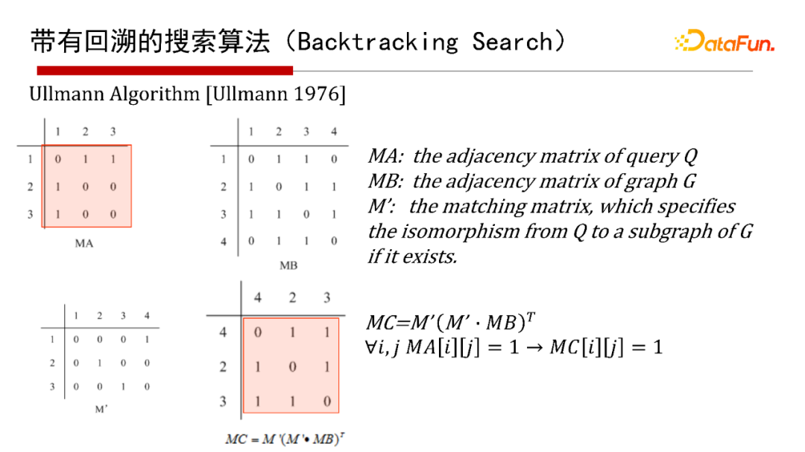
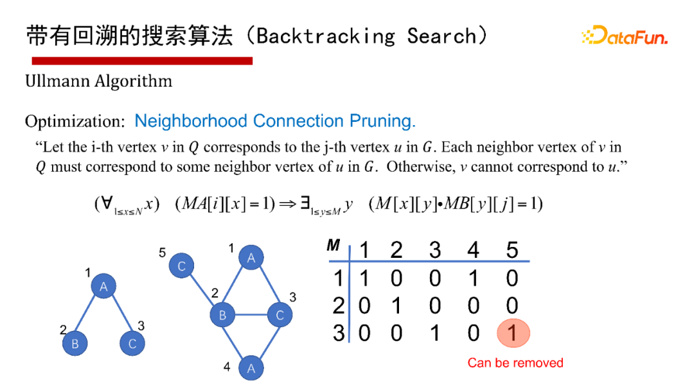
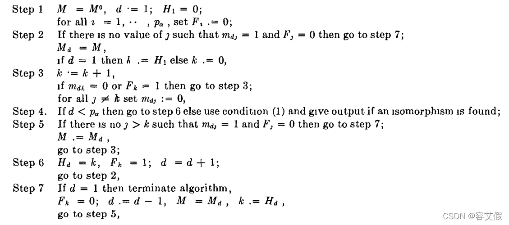
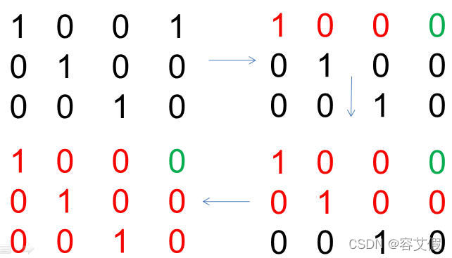
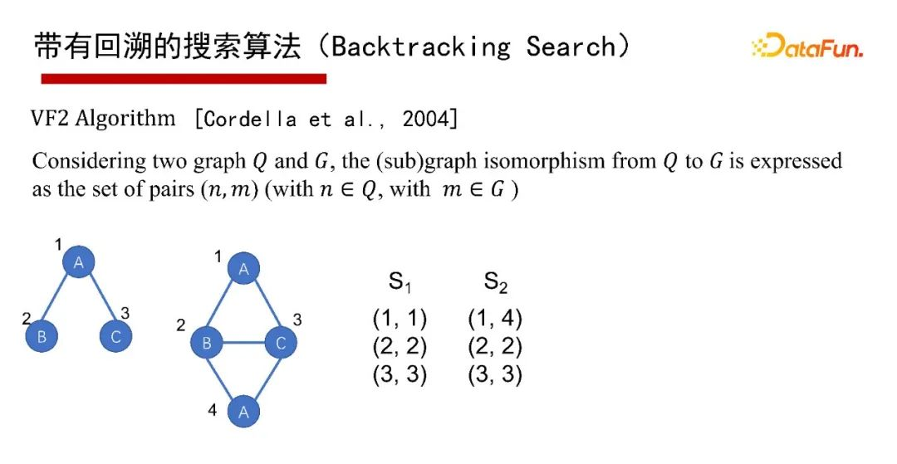
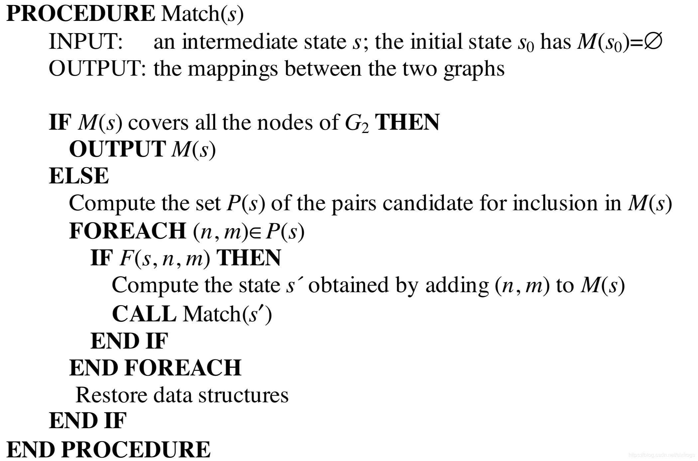
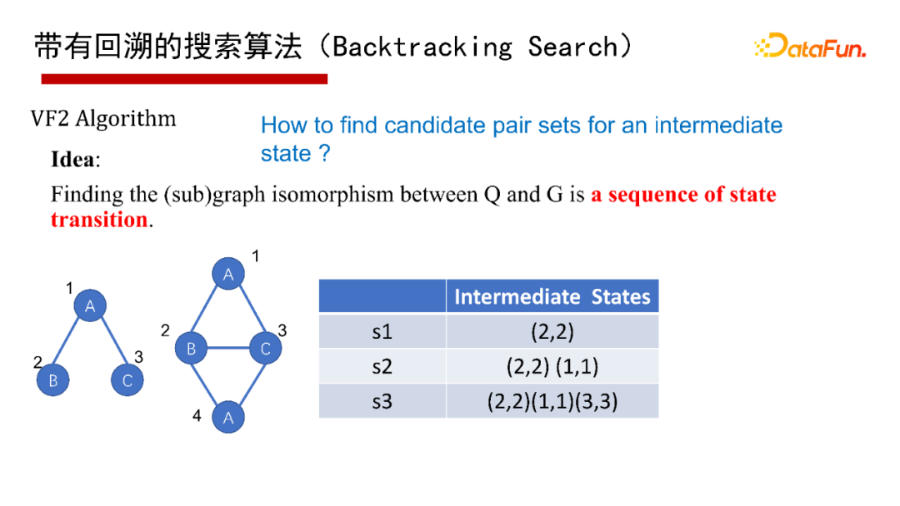

# Subgraph Matching History and Algorithms

We summarize the subgraph matching (Subgraph Matching, Subgraph Isomorphism) graph algorithms here.

Mathematical theory introduction:
https://arxiv.org/abs/1512.03547

## What is Subgraph Matching?

The core concept of subgraph matching is given a query graph Q and a data graph G, each vertex in Q is mapped to G through an injective function, i.e., the injective function $f:V(Q)→V(G)$. Each vertex in Q is uniquely mapped to each vertex in G under the injective function $F$. As shown in the figure above, vertices 1, 2, 3 in Q have the first subgraph match (1, 2, 3) in G, and the second subgraph match is (2, 3, 4). The essence of subgraph matching is to find all matches of Q in G given a Q, such as finding all binary structures in the example.


From the perspective of computational complexity, subgraph matching is a very complex problem. If no restrictions are imposed on the query graph Q, the decision problem of subgraph matching is NP-Complete; enumerating all locations where subgraph matches occur is NP-Hard. Although the matching algorithm itself is exponential, in practice, a large number of filtering strategies can be used to prune the search space, thereby improving query performance.

We found the following explanation in the *"Data Mining"* book:

**Definition 17.2.1 (Graph Matching and Isomorphism)** Two graphs $G_{1}=(N_{1},A_{1})$ and $G_{2}=(N_{2},A_{2})$ are isomorphic if and only if a one-to-one correspondence can be found between the nodes of N1 and N2 that satisfies the following properties:

1. For each pair of corresponding nodes $i∈N_1$ and $j\in N_2$, their labels are the same.
   $l(i)=l(j)$

2. Let $[i_1，i_2]$ be a node pair in $G_1$, and $[j_1，j_2]$ be the corresponding node pair in $G_2$. Then edge $(i_1，i_2)$ exists in G1 if and only if edge $(j_1，j_2)$ exists in $G2$.

The computational challenge in graph matching arises from the duplication in node labels. For example, consider two methane molecules. Although the unique carbon atoms in the two molecules can be perfectly matched, the hydrogen atoms can be matched in 4! = 24 different ways. Two possible matches are shown. In general, the higher the level of label duplication in each graph, the greater the number of possible matches. The number of possible matches between a pair of graphs grows exponentially with the size of the matching graph. For each pair of graphs containing n nodes, the number of possible matches can be as large as $n!$. This makes the problem of matching a pair of graphs computationally very expensive.

**Lemma 17.2.1** The problem of determining whether a match exists between a pair of graphs is NP-hard.

**Definition 17.2.2 (Node-Induced Subgraph)** A node-induced subgraph of graph $G =(N,A)$ is a graph $G_ s =(N_s,A_s)$ that satisfies the following properties:

1. $N_s\subseteq N$
2. $A_s=A\cap(N_s\times N_s)$

In other words, in subgraph $G_s$, all edges in the original graph $G$ between nodes in subset $N_s$ are included.

Subgraph isomorphism can be defined using node-induced subgraphs. Query graph $G_q$ is a subgraph isomorphism of data graph $G$ when it is an exact isomorphism of a node-induced subgraph of G.

**Definition 17.2.3 (Subgraph Matching and Isomorphism)** Query graph $G_q=(N_q,A_q)$ is a subgraph isomorphism of data graph $G =(N，A)$ if and only if the following conditions are satisfied:

1. Each node in $N_q$ should match a unique node in $N$ with the same label, but each node in $N$ may not necessarily match. For each node $i∈N_q$, there must exist a unique matching node $j∈N$ such that their labels are the same.
   $l(i)=l(j)$

2. Let $[i1，i2]$ be a node pair in $G_q$, and according to the matching discussed above, let $[j1，j2]$ be the corresponding node pair in G. Then edge $(i1，i2)$ exists in $G_q$ if and only if edge $(j1，j2)$ exists in G.

The definition of subgraph isomorphism in this section assumes that all edges of the node-induced subgraph of the data graph exist in the query graph. In some applications, such as frequent subgraph mining, a more general definition is used where any subset of edges of the node-induced subgraph is also considered a subgraph isomorphism. The more general case in this section can be handled by making minor changes to the algorithm. Note that the above definition allows subgraph $G_q$ (or G) to be disconnected. However, for practical applications, usually only connected subgraph isomorphisms are of interest. Figure 17.3 illustrates an example of two possible subgraph matches between a pair of nodes. The figure also shows that there are two different ways for one graph to be a subgraph of another. The exact matching problem is a special case of subgraph matching. Therefore, the subgraph matching problem is also NP-hard.

**Lemma 17.2.2** The subgraph matching problem is NP-hard.

Subgraph matching is often used as a subroutine in applications such as frequent pattern mining. Although the subgraph matching problem is a generalization of exact matching, the problem can be further generalized to the problem of finding the maximum common subgraph (MCG) between a pair of graphs. This is because the MCG between two graphs is at most equal to the smaller of the two graphs when it is a subgraph of the larger graph. The MCG or maximum common isomorphism between a pair of graphs is defined as follows.

**Definition 17.2.4 (Maximum Common Subgraph)** The MCG between a pair of graphs $G_1 =（N_1，A_1）$ and $G_2 =（N_2，A_2）$ is a graph $G_0 =（N_0，A_0）$ that is a subgraph isomorphism of both $G_1$ and $G_2$, and the size of node set $N_0$ is as large as possible.

Because the MCG problem is a generalization of the graph isomorphism problem, it is also NP-hard. In this section, algorithms for discovering subgraph isomorphisms and maximum common subgraphs will be introduced. Subsequently, the relationship of these algorithms to distance calculation between graphs will be discussed. Subgraph isomorphism algorithms can be designed to determine all subgraph isomorphisms between a query graph and a data graph, or fast algorithms can be designed to determine whether at least one isomorphism exists.

## Algorithm Development Overview


In a SIGMOD 2020 experimental paper, it was pointed out that there are two types of algorithms for subgraph matching: one is based on depth-first search with backtracking (Backtracking Search), and the other is based on breadth-first Multi-way Join methods.


Here's a figurative explanation of the two types of subgraph matching algorithms. Suppose there is a $Q$ and a $G$, and we want to find subgraph matches of $Q$ in $G$, which is actually searching in the search space. Here we define the search space as a search tree (as shown in the attribute graph in the lower left corner of the figure above). The Backtracking Search strategy is depth-first search (DFS search), then backtrack; the Multi-way Join search strategy is breadth-first search (BFS search), which searches layer by layer on the search tree.

### Backtracking Search

Backtracking Search algorithms include the earliest Ullmann algorithm from 1976, the Ullmann Algorithm from 2000, the VF2 Algorithm from 2004, etc.


Here we use a general algorithm framework (Common Framework) to explain backtracking search algorithms. Given a query graph Q, first define a matching order for nodes, i.e., which node to match first, then which node (generate a matching order), then try to match node by node according to the node matching order; if the current state cannot be matched, backtrack; if you want to find all solution sets, you also need to backtrack. The advantage is that it can avoid generating a large number of intermediate results, because it uses depth-first search, only has the space of the recursive call stack, and no intermediate results. The disadvantage is that it is difficult to execute in parallel and has a lot of recursive overhead, so it is suitable for LIMIT K and TOP-K subgraph matching queries, i.e., only returning K or TOP K results (when K is small).

### Multiway Join


For breadth-first algorithms, each Join in relational databases is actually breadth-first. Subgraph matching is logically a Join operation of T1, T2, T3. How is Join executed? From the perspective of Join execution, there are two different execution schemes. One is Binary Join, where the first table T1 and the second table T2 are joined, and the result is joined with the third table T3, which is edge-centered.

**Worst-Case Optimal Join:**


The core idea of the Worst-Case Optimal Join algorithm is to efficiently extend intermediate matching results through set intersection operations. We illustrate its execution process through a specific case: Suppose we have found a match for edge BC of query graph Q in data graph G (i.e., vertex v2 in G corresponds to u2 in Q, v3 corresponds to u3), and now we need to further search for complete matches that conform to the triangle ABC structure in Q.

**Specific execution steps are as follows:**

1. **Candidate vertex filtering**
   - Based on the matched edge BC (v2-v3), obtain the neighbor set N(v2) of v2 and the neighbor set N(v3) of v3 in the data graph respectively
   - At the same time, extract the candidate set C(u1) of query node u1 (corresponding to point A) in the data graph

2. **Three-way set intersection operation (This is what Binary doesn't have!)**
   Perform intersection operation on the above three sets:
   ```
   N(v2) ∩ N(v3) ∩ C(u1) = {v1, v4}
   ```
   This result indicates that in the data graph, the vertices that are connected to both v2 and v3 and meet the candidate conditions of u1 are v1 and v4.

3. **Generate complete matches**
   Combine the intersection results with the matched v2 and v3 to produce two matches that satisfy the triangle structure:
   - Match 1: (v1, v2, v3) corresponds to (u1, u2, u3) in Q
   - Match 2: (v4, v2, v3) corresponds to (u1, u2, u3) in Q

4. **Parallelization advantages**
   The key characteristic of this algorithm is that the processing of each row in the intermediate result table (such as the v2-v3 match in this example) is completely independent. This stateless computational characteristic makes the following operations naturally support parallelization:
   - Multiple rows of data can be processed distributedly
   - Set intersection operations can be accelerated with multithreading
   - Result generation has no order dependency

Through this method of expanding intermediate results layer by layer and filtering invalid candidates based on set intersection operations, the algorithm ensures both theoretically optimal time complexity in the worst case and efficient parallel capability at the engineering implementation level.


The reason it's called Worst Case Optimal Join is relative to Binary Join, whose complexity matches the number of output results in the worst case. Taking the ABC triangle query graph as an example, it has at most $N^{1.5}$ triangles, where N is the number of edges. If Binary Join is used, it may produce $N^2$ intermediate results. If the Worst Case Optimal Join algorithm is used, it will never produce more than $N^{1.5}$ intermediate results, and its runtime complexity is also $N^{1.5}$. For other query graphs, Worst Case Optimal Join also exhibits this characteristic.

Heuristically speaking, Worst Case Optimal Join and Binary Join each have their benefits. Binary Join is more suitable for query graphs with no cycles or tree-like structures or sparse cycles. Worst Case Optimal Join is more suitable for dense cyclic query graphs. Therefore, a better Join method depends on the graph structure of the query graph.

## Ullman(1976) Detailed Explanation

**Idea: Transform to adjacency matrices and perform some similarity transformation**



Let the adjacency matrix corresponding to query graph Q be $M_A$, and the adjacency matrix corresponding to data graph G be $M_B$. We hope to find a method to determine whether $M_A$ is a subgraph of $M_B$, or whether $M_A$ can be isomorphic to a subgraph of $M_B$.

Based on the above idea, is there a transformation $M'$ that can transform $M_A$ into something, or transform $M_B$ into something, so that this thing can determine the relationship between $M_A$ and $M_B$. Define this transformed thing as $M_C$. A naive idea is, if the transformed thing $M_C$ is part of $M_B$, can we say that $M_A$ is a subgraph of $M_B$, or isomorphic to $M_B$?

Using $M_A$ for addition seems very laborious, and matrices are not designed for addition. Can we apply $M'$ to $M_B$ and make this result comparable to $M_A$?

[Knowledge Graph — Subgraph Isomorphism Algorithm Ullmann Algorithm](https://blog.csdn.net/weixin_46627433/article/details/122842530)



https://github.com/betterenvi/Ullman-Isomorphism



**Step 1:**
Establish matrix $M_{n\times m}$, then determine:

If the i-th vertex in Q has the same label as the j-th vertex in G; and
the degree of the i-th vertex in Q is less than or equal to the degree of the j-th vertex in G, then:

$$M[i][j] = 1$$

**Step 2:**

Generate matrix $M'$ from matrix $M_{n\times m}$. That is, check $M_{n\times m}$ row by row, change some non-zero elements to 0, so that matrix $M'$ satisfies that each row has exactly one element equal to 1, and each column has at most one element not equal to 0. (Maximum depth is $|M_A|$.)

**Step 3:**

Determine whether matrix $M'$ satisfies the condition according to the following rule:

$M_C=M'(M'\cdot M_B)^T, \forall i\forall j:(M_A[i][j]=1)\Rightarrow(M_C[i][j]=1).$

**Step 4:**

Iterate the above steps and list all possible matrices $M'$.

### General idea: Find submatrices of adjacency matrices, multiply to get a special matrix, and determine whether the matrix M' has properties to judge isomorphism



Multiply $M'$ with $M_B$ pointwise to extract edges labeled 1, 2, 3 in G. This result is still an adjacency matrix, meaning it contains all vertices in G, but only edges of vertices 1, 2, 3;

To eliminate other vertices and generate an induced subgraph containing only vertices 1, 2, 3, multiply $M'$ with the transpose of $M_B$ pointwise, then multiply with $M'$ to get the induced subgraph $M_C$;

Since the adjacency matrix is symmetric, we finally only need to compare this induced subgraph's adjacency matrix with $M_A$. If all edges that exist in $M_A$ also exist in $M_C$, it indicates that the query is valid, and the corresponding mapping is $M'$;

Define the formula for the above method as $M_C=M'(M'\cdot M_B)^T$. When the following judgment is all true, it indicates that the query is valid, and one mapping of Q in G is $M'$:

## VF2(2004) Detailed Explanation

Original paper:
An Improved Algorithm for Matching Large Graphs

https://blog.csdn.net/sixfrogs/article/details/105572782



The VF2 algorithm is an optimization of the traditional Ullmann algorithm, employing more pruning strategies that can significantly reduce the search space and improve matching efficiency. Its main advantage lies in its intelligent pruning, constraint propagation, and backward propagation strategies to reduce unnecessary computations, thereby solving graph isomorphism problems faster.
The VF algorithm can solve directed/undirected, labeled/unlabeled graph isomorphism problems.

The basic idea of the VF2 algorithm is to find isomorphic relationships between pattern graphs (small graphs) and target graphs (large graphs) through depth-first search (DFS) and backtracking. The core of the algorithm is to effectively reduce the search space of invalid matches through constraint propagation and pruning.

Algorithm logic:


Let's explain the VF2 subgraph isomorphism algorithm process through a simple example.

### Example:

We have the following two graphs: **Pattern Graph (P)** and **Target Graph (G)**. We need to check whether the pattern graph is a subgraph of the target graph.

#### Pattern Graph P (small graph)

```
P:    A -- B
         |
         C
```

- Vertices: A, B, C
- Edges: A-B, B-C

#### Target Graph G (large graph)

```
G:    1 -- 2
         |
         3
         |
         4
```

- Vertices: 1, 2, 3, 4
- Edges: 1-2, 2-3, 3-4

#### Objective:
We want to check whether pattern graph P is a subgraph of target graph G, i.e., find whether there exists a vertex mapping relationship such that the structure of the pattern graph can find a completely corresponding relationship in the target graph.

### VF2 Algorithm Process:

1. **Initialization:**
   - Pattern graph P has 3 vertices: A, B, C. Target graph G has 4 vertices: 1, 2, 3, 4.
   - Our task is to try to map vertices of P to vertices of G recursively while maintaining the edge structure of the graph unchanged.

2. **Vertex Matching:**
   - We first select a vertex from pattern graph P for matching. Suppose we start with vertex A from pattern graph P.

   - **Step 1:** Try to map vertex A of pattern graph P to one of vertices 1, 2, 3, 4 in target graph G. We try these mappings one by one to see which one best meets the conditions.

     - **A → 1**: In G, there is an edge between vertex 1 and vertex 2 (1-2), but vertex A in the pattern graph is not connected to C, so this mapping does not meet the conditions.
     - **A → 2**: In G, vertex 2 has edges with vertices 1 and 3. After trying to match A with 2, we find that vertex A indeed conforms to vertex A in pattern graph P (because 2 has edges connected to 1 and 3), so we map A to vertex 2 in G.

   - **Step 2:** Now, we continue to match B and C in pattern graph P. Vertices B and C in the pattern graph need to be mapped to vertices in target graph G.

     - Vertex B is connected to A by an edge (A-B), so B must be mapped to a vertex in G that is adjacent to vertex 2. The vertices adjacent to 2 in G are 1 and 3.
     - Try B → 3, this way there is a match for edges B-C and C-B. Continuing to check, we find that edge C connects to B, so B → 3 is valid.
   
     - Now vertex B matches with vertex 3 in the target graph, and next we try to match C.

     - **Step 3:** For C, it needs to be connected to B, so C should be mapped to 4 in G (because B has already matched with 3 in G, and C should be adjacent to B). So C → 4.

   Now we get the following matching:
   - A → 2
   - B → 3
   - C → 4

3. **Check Edge Matching:**
   - Now we have given the mapping of each vertex in pattern graph P. Next, we need to check whether the edge mapping also conforms.
   
   - In pattern graph P, there are edges between A and B, and between B and C.
     - In target graph G, there is an edge between 2 and 3 (A → 2, B → 3), and an edge between 3 and 4 (B → 3, C → 4).
     
   - Since all edges have been correctly mapped, we can confirm that this matching is valid.

### Result:
We found a valid matching, i.e., the vertices and edges of pattern graph P completely match the vertices and edges of target graph G. Therefore, pattern graph P is a subgraph of target graph G.

### Further Explanation:
The VF2 algorithm accelerates the graph isomorphism matching process through the following steps:

1. **Constraint Propagation**: During the matching process, the algorithm uses constraints between already matched vertices to filter possible matches for the next step. For example, the choice of vertex A affects the choices of B and C, ensuring that adjacency constraints are satisfied.
   
2. **Pruning Strategy**: During the matching process, the algorithm does not try every possible vertex match, but reduces unnecessary attempts based on heuristic methods and the current matching state (such as no longer considering matches like A → 1 that do not meet conditions).

3. **Backtracking**: If a matching step fails, the algorithm backtracks and tries other possible matches until it finds a complete subgraph isomorphism.

### Summary:
The VF2 algorithm effectively improves the solving efficiency of subgraph isomorphism problems by combining depth-first search with backtracking, plus constraint propagation and pruning techniques. In practical applications, this method is more efficient than the traditional Ullmann algorithm, especially performing better in graph structures with strong constraints.



## Reference

[Peking University Zou Lei: Subgraph Matching Algorithms in Graph Databases - DataFunTalk](https://www.cnblogs.com/datafuntalk/p/16160891.html)
[Knowledge Graph — Subgraph Isomorphism Algorithm Ullmann Algorithm](https://blog.csdn.net/weixin_46627433/article/details/122842530)
[Chapter 17 Graph Data Mining - "Data Mining" Chinese Version](https://dm-trans.github.io/DM-trans/17/)
