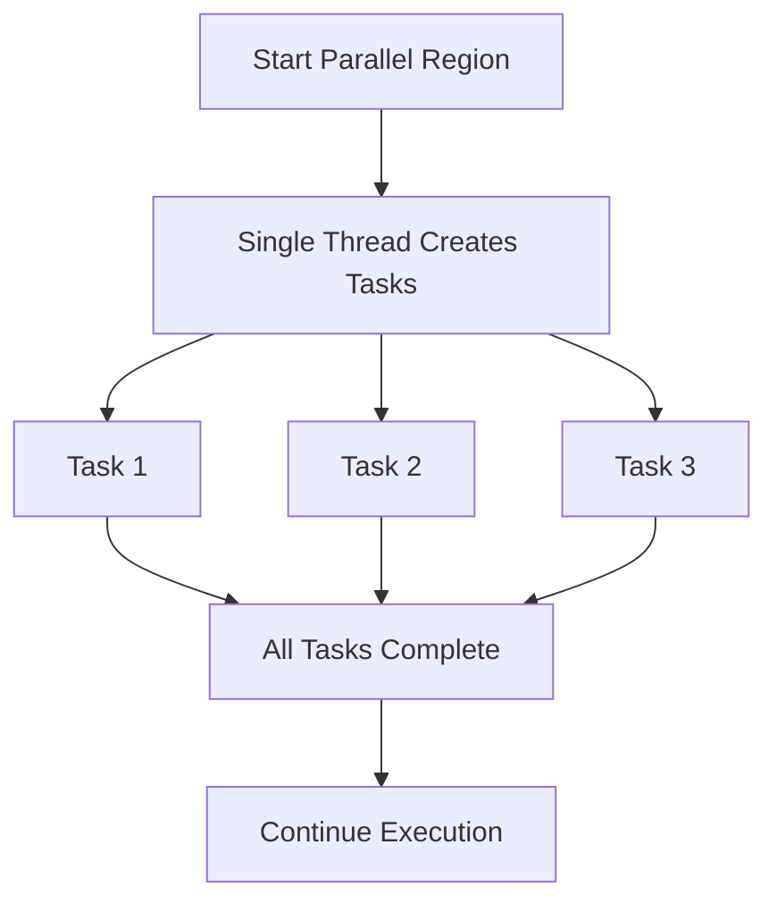

# Understanding OpenMP Tasks: Flexible Parallelism for Modern C++ Applications

Parallel programming is essential for leveraging the full computational power of modern multi-core processors. OpenMP, as a widely adopted API for shared-memory parallelism in C and C++, provides a rich set of constructs to express parallelism in a simple and portable way. Among these constructs, the concept of "tasks" stands out as a powerful tool for expressing irregular, dynamic, and nested parallelism that goes beyond the classic loop-based parallelism.

## What is an OpenMP Task?

In OpenMP, a *task* is a unit of work that can be executed independently by any thread in a team. Unlike the traditional `parallel for` construct, which is best suited for regular, data-parallel workloads, tasks are designed to handle situations where the amount of work or the dependencies between work units are not known in advance. This makes tasks ideal for recursive algorithms, dynamic programming, and workloads with unpredictable execution paths.

When a task is created, it may be executed immediately by the thread that created it, or it may be deferred and executed later by any available thread. The OpenMP runtime system manages the scheduling and execution of tasks, allowing the programmer to focus on expressing parallelism rather than managing threads directly.

## Why Use Tasks?

The classic OpenMP parallel constructs (`parallel`, `parallel for`, `sections`, etc.) are efficient for regular, structured parallelism, such as processing arrays or matrices. However, many real-world problems involve irregular or nested parallelism. Examples include:

- Recursive algorithms (e.g., quicksort, tree traversal)
- Workloads with dynamically generated tasks (e.g., task graphs, pipelines)
- Applications where the amount of work per iteration is highly variable

In these cases, using tasks allows for more flexible and efficient parallelization. Tasks can be created dynamically as the computation progresses, and the OpenMP runtime can balance the workload across threads, improving resource utilization and scalability.


| Feature | parallel for | task | section |
|-----------------|-------------|--------------|--------------|
| Workload Type | Regular | Irregular | Manual split |
| Dynamic Gen | No | Yes | No |
| Nested Support | Limited | Yes | Yes |


## Basic Usage of OpenMP Tasks

The basic syntax for creating a task in OpenMP is straightforward:

```cpp
#pragma omp task
{
    // Code to execute as a task
}
```

Tasks can be created inside any parallel region. For example, in a recursive function, you might create a new task for each recursive call:

```cpp
void process_node(Node* node) {
    // Do some work on the current node

    #pragma omp task
    if (node->left) process_node(node->left);

    #pragma omp task
    if (node->right) process_node(node->right);
}
```

To ensure that all tasks are completed before proceeding, you can use the `#pragma omp taskwait` directive:

```cpp
#pragma omp taskwait
```

This tells the current thread to wait until all child tasks generated in the current region are finished.

## Taskgroups and Synchronization

OpenMP 4.0 introduced the concept of *taskgroups*, which allow you to group a set of tasks and wait for their completion collectively. This is particularly useful in recursive or divide-and-conquer algorithms, where you want to synchronize at certain points without waiting for all outstanding tasks in the program.

Example:

```cpp
#pragma omp taskgroup
{
    #pragma omp task
    process_subproblem1();

    #pragma omp task
    process_subproblem2();
    // Both tasks are part of the same group
}
// Implicit barrier: both tasks must complete before proceeding
```

## Single and Master Constructs

When using tasks, it is common to combine them with the `single` or `master` constructs to ensure that only one thread generates the initial set of tasks, avoiding redundant work:

```cpp
#pragma omp parallel
{
    #pragma omp single
    {
        // Only one thread enters here and creates tasks
        for (int i = 0; i < N; ++i) {
            #pragma omp task
            do_work(i);
        }
    }
    // All threads can execute tasks
}
```

## Practical Considerations

- **Granularity**: Creating too many fine-grained tasks can overwhelm the runtime and lead to overhead. It is important to balance the amount of work per task.
- **Dependencies**: OpenMP 4.0 and later support task dependencies, allowing you to specify that certain tasks must complete before others begin. This is useful for expressing complex workflows.
- **Task Scheduling**: The OpenMP runtime is responsible for scheduling tasks. While you cannot control the exact order of execution, you can influence scheduling through task dependencies and careful structuring of your code.
- **Nested Parallelism**: Tasks can be nested, and tasks can themselves generate new tasks. This enables expressing complex, hierarchical parallelism.

## Example: Parallel Fibonacci

A classic example to illustrate tasks is the parallel computation of Fibonacci numbers:

```cpp
int fib(int n) {
    int x, y;
    if (n < 2) return n;
    #pragma omp task shared(x)
    x = fib(n - 1);
    #pragma omp task shared(y)
    y = fib(n - 2);
    #pragma omp taskwait
    return x + y;
}
```

This example is for illustration; in practice, you would want to limit task creation for small `n` to avoid excessive overhead.

## Conclusion

OpenMP tasks provide a flexible and powerful mechanism for expressing parallelism in C++ programs, especially when dealing with irregular, dynamic, or nested workloads. By leveraging tasks, developers can write scalable and efficient parallel code for a wide range of applications, from scientific computing to real-time data processing.

When using tasks, it is important to consider task granularity, synchronization, and dependencies to achieve optimal performance. With the continued evolution of the OpenMP standard, tasks are becoming an increasingly important tool in the parallel programmer's toolkit.

---

If you want to see concrete code examples, explore the files in the `openmp_task` directory (`task.cpp`, `taskgroup.cpp`, `test_task.cpp`) for practical demonstrations of these concepts.





